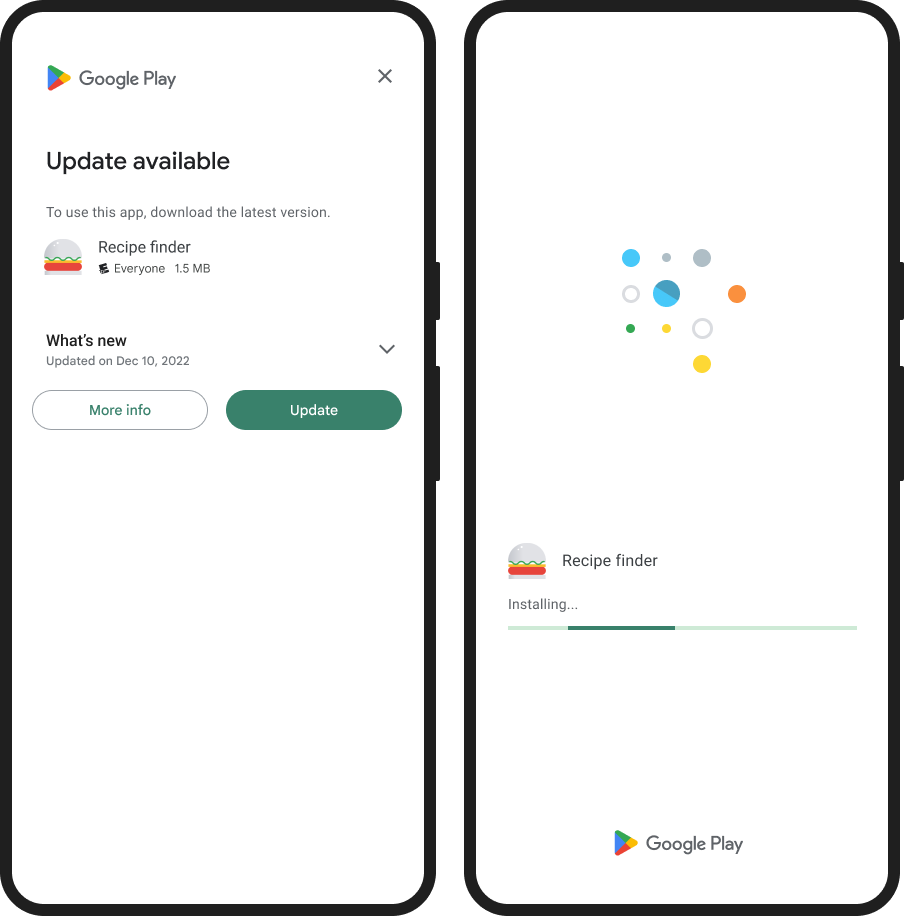

# expo-playcore-in-app-update

Android in-app update module for Expo using Google Play Core API (Immediate Updates).

---

## 📦 Installation

```bash
npx expo install expo-playcore-in-app-update
```

---

## 🚀 Usage

```tsx
import { useEffect } from 'react';
import { Platform } from 'react-native';
import { triggerImmediateUpdate } from 'expo-playcore-in-app-update';

useEffect(() => {
  if (Platform.OS === 'android') {
    console.log('Android detected, triggering immediate update...');
    triggerImmediateUpdate();
  }
}, []);
```

---

## 📱 Platform Support

* ✅ Android
* ❌ iOS (not supported)

---

### Example: Immediate Update Popup



* Figure: **An example of an immediate update flow.**

## ⚠️ Important Notes

* Uses **Google Play Core In-App Updates API**
* Works **only for apps installed via Google Play Store**
* Supports **Immediate Update flow only**
* The update UI is fully controlled by Google Play
* Users may cancel the update — enforce updates at app level if required

---

## 🔒 Recommended (Force Update Strategy)

If your app requires users to update:

* Trigger update on app launch
* Re-trigger on app resume (AppState)
* Optionally block UI until update is completed
* Use backend version check for strict enforcement

---

## 📄 License

MIT
